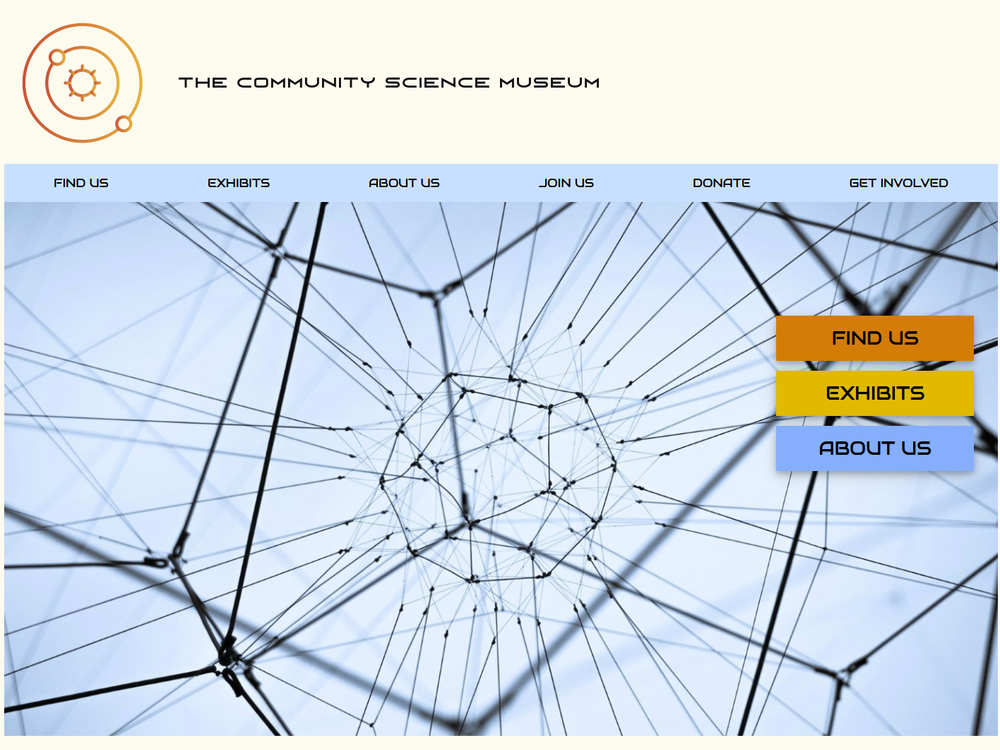

# The Community Science Museum

Semester project.

Core target audience: Primary and middle school children (ages 7-15) and families with young children. The website is meant to be informative and engaging, encouraging viewers to visit the museum. Also, the website should be responsive and easy to use on various devices.

## Description

The site must have a design that appeals to the target audience.
The site must have at least 4-6 pages.
Compositional principles, typography, and colour schemes must be considered.
Your HTML should be semantic and neatly indented.
The site should use external CSS style sheets which follow the DRY principle.
The site should download quickly and not be overly “heavy”. Images should be at most 200kb.
The site should consider WCAG principles, especially regarding hierarchy, navigation, and colour usage.
The site should be responsive, attractive, and easy to use on various devices.
The site should show consideration for content strategy and SEO (consider your use of meta tags and alt text).

## Built With

- HTML
- CSS

## Getting Started

### Installing

The site is pure html/css, so it only needs somewhere to host the files.

### Running

The site is hosted on https://jazzy-science.netlify.app/

## Contributing/Contact

The project page is on https://github.com/annikaeld/Science-Museum. Raise an [issue](https://github.com/annikaeld/Science-Museum/issues) on the project page if you have any feedback.
